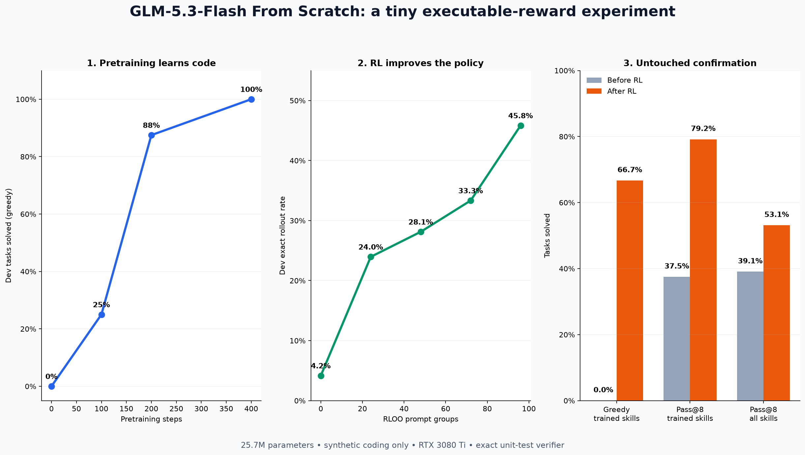
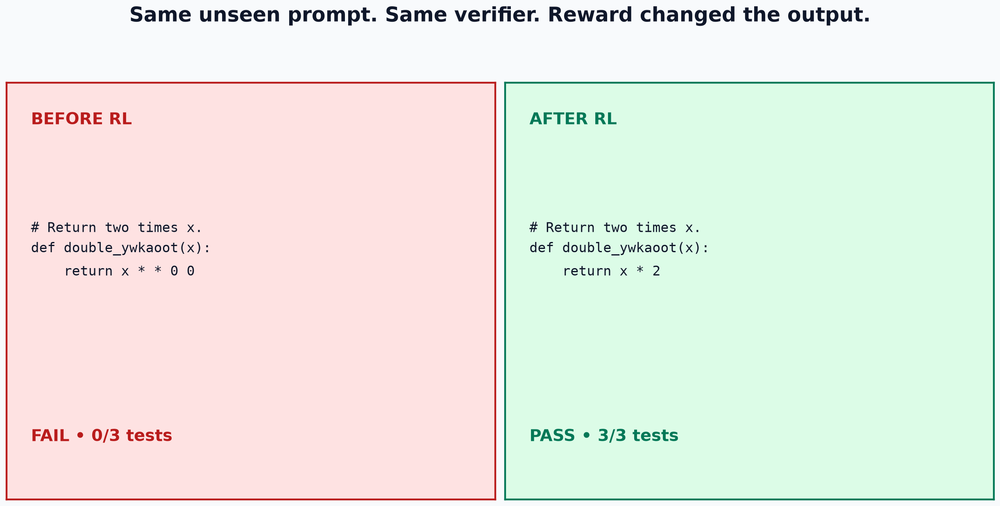
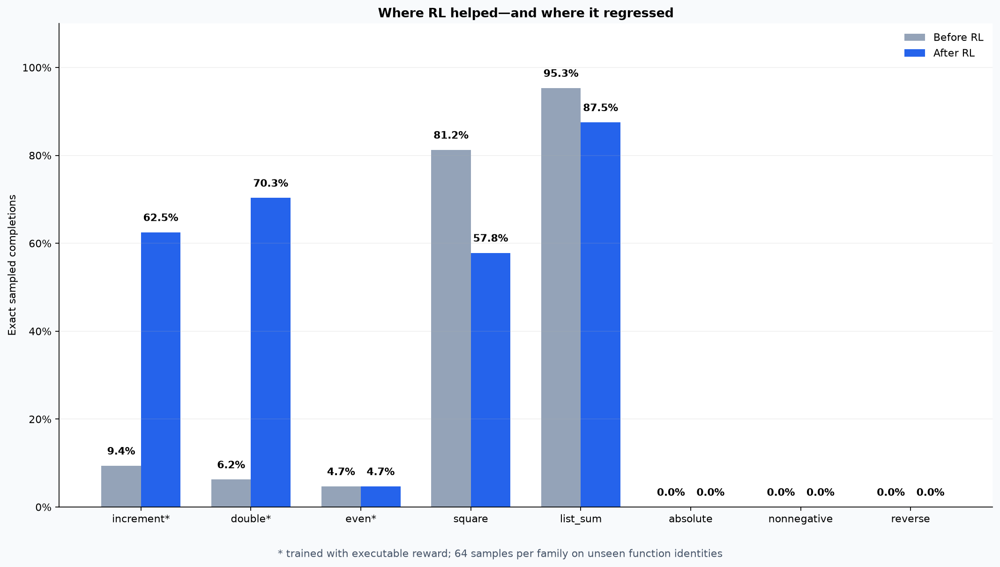

# Build & Train GLM-5.3-Flash From Scratch

A readable 25.7M-parameter language model inspired by GLM-5.3-Flash, trained from random initialization and then improved with executable-reward reinforcement learning. The same code supports NVIDIA CUDA, Apple Silicon MPS, and CPU execution.



## Result

The frozen confirmation set used unseen function names and was opened only after training duration was selected on dev.

| Confirmation metric | Before RL | After RL |
|---|---:|---:|
| Greedy pass@1, three trained families | 0/24 | **16/24** |
| Sampled pass@8, three trained families | 9/24 | **19/24** |
| Exact sampled completions, three trained families | 13/192 | **88/192** |
| Sampled pass@8, all eight families | 25/64 | **34/64** |

The paired greedy comparison had 16 gains and zero losses on the trained-family confirmation tasks (exact McNemar/binomial p = 0.0000305). The task-level bootstrap interval for the sampled absolute gain was +25.0 to +53.1 percentage points. Those statistics describe this synthetic benchmark; they do not establish broad coding ability.



RL made `increment` and `double` reliable after those operation patterns had already appeared in pretraining. It did not make `even` reliable, and sampled performance regressed on the untrained `square` and `list_sum` families. That interference is part of the result, not hidden.



## What was built

The real GLM-5.3-Flash has 320B total parameters, 18B active parameters, 45 text layers, hybrid linear/sparse attention, MoE, four-stream mHC, IndexPool, a one-million-token context, and native multimodality. This repository implements a scaled language model plus an optional miniature image path:

| Component | Released model | This project |
|---|---:|---:|
| Total parameters | 320B | 25,730,592 |
| Estimated active parameters/token | 18B | 9,805,344 |
| Layers | 45 | 12 |
| Attention pattern | 34 linear + 11 sparse | 9 linear + 3 gathered sparse |
| Routed experts | 288, top-8 | 8, top-2 |
| Shared experts | 1 | 1 |
| Residual streams | four-stream mHC | four learned streams, simplified |
| Tokenizer | byte-level BPE, 154,880 model vocabulary | raw UTF-8 bytes, 260 tokens |
| Context | up to 1M | 192 tokens |
| Modalities | text, image, video | text and fixed-size RGB images |

The model uses the released model's high-level `linear, linear, linear, sparse` rhythm. Its ELU-feature linear attention is not GLM's exact KDA implementation; its local-plus-strided gathered attention is not DeepSeek Sparse Attention with an indexer; and its learned stream mixer is not the full manifold-constrained Sinkhorn formulation. This is an educational implementation, not a reproduction.

The released tokenizer compresses frequent byte sequences into BPE tokens. For example, its published tokenizer encodes `def increment(x):` as four tokens: `def`, ` increment`, `(x`, and `):`. This project deliberately uses one token per UTF-8 byte, so the same ASCII string takes 17 tokens. The byte tokenizer needs no learned vocabulary, represents any text exactly, and keeps the embedding and output matrices tiny. Its cost is longer sequences. The model therefore predicts the **next byte** – equivalent to the next character for ASCII code, but not necessarily for multi-byte Unicode characters.

```text
bytes → embedding → four residual streams
                  ↓
       [linear attention + MoE] × 3
                  ↓
       [sparse attention + MoE] × 1
                  ↓
             repeat × 3
                  ↓
          RMSNorm → tied LM head
```

## Experiment

1. Generate a tiny synthetic Python corpus directly on the GPU; no dataset download is required.
2. Pretrain from random weights for 400 steps. The run consumed 1,381,760 tokens in 63.1 seconds and peaked at 2.139 GiB allocated VRAM.
3. Select checkpoint 100 using dev because checkpoint 400 had saturated the tiny benchmark. The selected checkpoint had seen 345,995 tokens.
4. Run RLOO policy-gradient post-training on 96 prompts across `increment`, `double`, and `even`, with 16 sampled completions per prompt.
5. Give the policy only executable reward: `1` for passing all hidden tests, `0` for valid but wrong code, and `-0.1` for invalid code.
6. Select RL checkpoint 96 from a monotonic dev curve, then open the separate confirmation split once.

The final RL run used 1,536 rollouts, performed 73 reward-bearing updates, took 155.5 seconds, and peaked at 0.936 GiB allocated VRAM on an RTX 3080 Ti.

## Pretraining research: diversity, ordering, and curriculum

Three CPU-scale experiments used a 248,412-parameter miniature and 32 held-out expression structures so each comparison could be repeated across 10 paired seeds.

| Experiment | Matched comparison | Held-out target-byte result |
|---|---|---:|
| Data diversity | 8 repeated vs 88 diverse structures, 200 updates | 57.0% vs **60.2%**, p = 0.0137 |
| Example ordering | Exact same 4,800 examples, blocked vs interleaved | 50.5% vs **60.2%**, p = 0.00195 |
| Curriculum | 8 structures then 88 vs 88 from the start | 59.6% vs 60.2%, p = 0.2148 |

The strongest result is the ordering comparison: interleaving won across all 10 paired seeds even though the examples and compute were identical. Every condition remained at 0% exact-expression accuracy, so these results measure partial next-byte learning on synthetic code, not reliable program generation.

Reproduce and analyze the experiments:

```bash
python experiments/pretraining_data_diversity.py --help
python experiments/pretraining_curriculum_order.py --help
python experiments/analyze_pretraining_data_diversity.py --help
python experiments/analyze_pretraining_curriculum_order.py --help
```

Final raw results, charts, and reports are under [`artifacts/experiments`](artifacts/experiments).

## Follow-up research: which RL choices matter?

The first experiment established that executable feedback can teach narrow coding behaviors. The follow-up asked a different question:

> With the model, training data, learning rate, and total rollout budget fixed, which small RL design choice produces the strongest held-out policy?

This was a two-stage experiment. First, eight configurations were screened on 20 fixed dev tasks spanning `increment`, `double`, `square`, `even`, and `reverse`. Every arm started from the same pretrained checkpoint and generated exactly 128 training completions. The arms changed only one design choice at a time:

- **Reward density:** binary all-tests-pass reward versus fraction of hidden tests passed.
- **Invalid-code penalty:** `0`, `-0.1`, or `-1`.
- **Sampling temperature:** `0.20`, `0.35`, or `0.80`.
- **Rollout group size:** `4`, `8`, or `16` completions per prompt.

Group-size arms matched the number of sampled completions, not the number of optimizer updates. Consequently, group size 4 used 32 prompt groups, group size 8 used 16, and group size 16 used 8. That update-frequency and task-coverage difference is part of the treatment being measured.

| Screening arm | Dev tasks solved | Exact training completions | Effective updates | Training time |
|---|---:|---:|---:|---:|
| Binary reward, penalty `-0.1`, temperature `0.35`, group 8 | 5/20 | 26/128 | 10 | 170.3 s |
| Partial-test reward | 5/20 | 26/128 | 10 | 159.3 s |
| Invalid penalty `0` | 5/20 | 25/128 | 8 | 153.4 s |
| Invalid penalty `-1` | 5/20 | 26/128 | 10 | 151.7 s |
| Temperature `0.20` | 7/20 | 30/128 | 6 | 132.7 s |
| Temperature `0.80` | 6/20 | 5/128 | 10 | 313.0 s |
| Group size `4` | **8/20** | 24/128 | 19 | 154.6 s |
| Group size `16` | 6/20 | 20/128 | 5 | 103.9 s |

The screen appeared to favor group size 4. However, all seven paired comparisons with the standard group-8 arm had Holm-corrected p-values of `1.0`. The screen selected a candidate; it did not establish a result.

We therefore opened a separate 40-task confirmation split and compared group sizes 4 and 8 across three RL training seeds:

| Training seed | Group 8 | Group 4 | Group-4 difference | Exact paired p-value |
|---:|---:|---:|---:|---:|
| 31415 | 12/40 | 13/40 | +1 | 1.000 |
| 27182 | 14/40 | 13/40 | -1 | 1.000 |
| 16180 | 11/40 | 8/40 | -3 | 0.250 |
| **Mean** | **12.3/40** | **11.3/40** | **-1.0** | – |

The task-bootstrap 95% interval for the seed-averaged pass-rate difference was **-6.7 to +1.7 percentage points**, which crosses zero. The dev winner did not replicate: group size 4 won one seed, lost two, and was less stable. None of these ablations produced statistically persuasive evidence of improvement.

The useful scientific lesson is not “group size 4 is better.” It is that a small dev-set win under stochastic RL can reverse under fresh seeds and untouched tasks. Lower sampling temperature (`0.20`) remains the strongest unconfirmed lead; it should be replicated before spending more compute on longer training.

Reproduce the screen and confirmation:

```bash
./scripts/run_rl_variant_screen.sh
./scripts/run_rl_group_confirmation.sh
```

The analysis code is in [`scripts/analyze_rl_variants.py`](scripts/analyze_rl_variants.py) and [`scripts/analyze_rl_group_confirmation.py`](scripts/analyze_rl_group_confirmation.py). The screen uses paired exact McNemar tests with Holm correction. Confirmation reports each training seed separately and a task bootstrap after averaging within task across seeds. Because the benchmark contains only five synthetic operation families and three training seeds, these results do not establish broad coding improvement.

## Architecture-faithful miniature vision extension

The optional vision experiment now follows the released GLM-5.3-Flash image topology at teaching scale:

```text
32 x 32 RGB image
    -> 4 x 4 patch embedding: 8 x 8 = 64 patch tokens
    -> two bidirectional vision transformer blocks
    -> post-vision RMSNorm
    -> learned 2 x 2 spatial merge: 4 x 4 = 16 visual tokens
    -> gated multimodal projector: vision width -> LM width
    -> BOS <image_start> <image> x 16 <image_end> prompt bytes
    -> existing tiny GLM forward_embeddings path
    -> autoregressive next-byte prediction
```

The production model uses 448 x 448 RGB inputs, 14 x 14 spatial patches with temporal patching, 24 vision blocks at width 1024, 16 heads, 2D rotary positions, a 2 x 2 learned downsampler, and a gated projector to the 4096-wide language model. This miniature uses fixed 32 x 32 images, width 24, four heads, two blocks, learned positional embeddings, and no video or variable-resolution packing. The old direct-patch adapter remains only as `DirectPatchVisionLanguageModel`, a clearly labeled baseline that is not GLM-faithful.

The deterministic experiment uses generated RGB seven-segment digits, a held-out rendering seed, and answer-only next-byte loss. It downloads no data and writes no checkpoint.

```bash
python scripts/train_vision.py --smoke-test --architecture faithful --device auto
```

Reproduce the measured CPU comparison and write a receipt:

```bash
python scripts/train_vision.py \
  --architecture both --device cpu --seed 42 \
  --steps 120 --batch-size 40 --eval-examples 200 \
  --learning-rate 0.002 \
  --output artifacts/receipts/vision-miniature-rgb.json
```

On the recorded single-seed run, the faithful miniature improved from 0/200 to 119/200 held-out accuracy and loss `5.5809 -> 1.1618`. The smaller direct-patch baseline improved from 0/200 to 189/200 and loss `5.5758 -> 0.9608`. The baseline won this tiny short-run comparison. This does not show that the production topology is worse – it shows that added structure did not pay off under this very small model and training budget. See [`VISION_REPORT.md`](VISION_REPORT.md) for the exact configuration, timings, component audit, and limitations.

### Full 25.7M language-model integration pilot

A second bounded pilot attached the GLM-like vision encoder to the complete 12-layer language model initialized from the local step-100 coding checkpoint. All 12 language layers executed, while training was limited to the vision encoder, final LM block, final norm, and tied embedding/output matrix. No weights were saved.

| Metric | Before | After |
|---|---:|---:|
| Held-out RGB digit accuracy | 0/100 | **40/100** |
| Held-out cross-entropy | 8.389 | **1.555** |

The run used 40 updates, 400 generated training images, and 37 seconds on Apple Silicon MPS. It proves that the integration can learn this synthetic rendering task; it does not establish general vision ability. The first eleven LM blocks were frozen, the semantic digit classes were shared across train and evaluation, and this was one seed without a matched baseline.

After creating the local pretraining checkpoint, reproduce the no-checkpoint-saved pilot with:

```bash
python experiments/full_25m_vision_digit_pilot.py \
  --device auto --steps 40 --batch-size 10 --eval-examples 100 \
  --learning-rate 0.001 --max-seconds 540 \
  --checkpoint runs/glm53-coding-pretrain-001/checkpoint-0100 \
  --output artifacts/receipts/full-25m-vision-digit-pilot-seed73.json
```

See [`experiments/FULL_25M_VISION_DIGIT_PILOT_REPORT.md`](experiments/FULL_25M_VISION_DIGIT_PILOT_REPORT.md) for the exact receipt, trainable surface, and limitations.

## Quick start

```bash
git clone https://github.com/vukrosic/glm-5.3-flash-from-scratch.git
cd glm-5.3-flash-from-scratch
python3.12 -m venv .venv
source .venv/bin/activate
python -m pip install --upgrade pip
python -m pip install -r requirements.txt
python -m pytest -q
```

Use Python 3.12 because the pinned PyTorch 2.5.1 release does not provide Python 3.13 wheels. This setup works on macOS with Apple Silicon, Linux with NVIDIA CUDA, and CPU-only machines. The training scripts accept `--device auto` and select the available backend.

## Open the complete course slides

The repository includes the HTML slideshow, the real before-and-after generation animation, and the small chart assets it uses.

```bash
python slides/serve_slides.py --port 8765
```

Then open [http://127.0.0.1:8765/slides.html](http://127.0.0.1:8765/slides.html). On macOS, `slides/start-slides.command` starts the server and opens the deck automatically.

## Reproduce the GPU experiment

After completing the quick start:

```bash
./run_gpu.sh -m pytest -q
```

Pretrain:

```bash
./run_gpu.sh scripts/train_pretrain.py \
  --output runs/glm53-coding-pretrain-001 \
  --steps 400 \
  --checkpoints 100,200,400 \
  --batch-size 32 \
  --sequence-length 128 \
  --learning-rate 3e-4 \
  --seed 42
```

Post-train with executable reward:

```bash
./run_gpu.sh scripts/train_rl.py \
  --initial-checkpoint runs/glm53-coding-pretrain-001/checkpoint-0100 \
  --output runs/glm53-executable-rloo-diverse-001 \
  --groups 96 \
  --checkpoints 24,48,72,96 \
  --group-size 16 \
  --tasks-per-family 32 \
  --families increment,double,even \
  --temperature 0.35 \
  --learning-rate 5e-5 \
  --train-scope last-block-head \
  --reward-mode binary
```

Evaluate the locked confirmation set:

```bash
./run_gpu.sh scripts/evaluate.py \
  --checkpoint runs/glm53-coding-pretrain-001/checkpoint-0100 \
  --split confirm --per-family 8 \
  --families increment,double,even \
  --output runs/confirm-greedy-pretrain-0100.json

./run_gpu.sh scripts/evaluate.py \
  --checkpoint runs/glm53-executable-rloo-diverse-001/checkpoint-0096 \
  --split confirm --per-family 8 \
  --families increment,double,even \
  --output runs/confirm-greedy-rl-0096.json
```

Every task, prompt, completion, unit-test count, seed, checkpoint hash, timing, and training rollout is preserved under [`artifacts/receipts`](artifacts/receipts). Model weights are intentionally excluded: rerunning both training stages takes roughly four minutes on the measured GPU.

## Repository map

- [`glm53_flash/model.py`](glm53_flash/model.py): hybrid attention, MoE, residual streams, and language model.
- [`glm53_flash/vision.py`](glm53_flash/vision.py): RGB patch embedding, two-block vision tower, 2 x 2 merger, projector, image tokens, and direct-patch baseline.
- [`glm53_flash/tasks.py`](glm53_flash/tasks.py): synthetic pretraining data and deterministic splits.
- [`glm53_flash/evaluator.py`](glm53_flash/evaluator.py): fail-closed AST and executable unit-test verifier.
- [`scripts/train_pretrain.py`](scripts/train_pretrain.py): random initialization and causal language-model pretraining.
- [`scripts/train_rl.py`](scripts/train_rl.py): batched RLOO with executable reward.
- [`scripts/evaluate.py`](scripts/evaluate.py): greedy pass@1 evaluation.
- [`scripts/evaluate_passk.py`](scripts/evaluate_passk.py): sampled policy evaluation.
- [`scripts/train_vision.py`](scripts/train_vision.py): deterministic generated-RGB training and held-out comparison.
- [`experiments/full_25m_vision_digit_pilot.py`](experiments/full_25m_vision_digit_pilot.py): bounded full-language-model vision integration test that never saves weights.
- [`experiments/FULL_25M_VISION_DIGIT_PILOT_REPORT.md`](experiments/FULL_25M_VISION_DIGIT_PILOT_REPORT.md): exact full-model vision pilot result and limitations.
- [`VISION_REPORT.md`](VISION_REPORT.md): exact vision result and official-to-miniature component audit.
- [`artifacts/receipts/pretraining-gpu-checkpoint-generation.json`](artifacts/receipts/pretraining-gpu-checkpoint-generation.json): exact same-prompt generations from GPU pre-training checkpoints 0, 100, and 200.
- [`slides/slides.html`](slides/slides.html): complete interactive YouTube course deck.
- [`slides/serve_slides.py`](slides/serve_slides.py): local slide and feedback server.
- [`YOUTUBE.md`](YOUTUBE.md): title options and generated thumbnail candidates.
- [`REPORT.md`](REPORT.md): complete method, analysis, negative pilots, and limitations.
- [`TUTORIAL.md`](TUTORIAL.md): the beginner course/video lesson.
- [`EXAMPLES.md`](EXAMPLES.md): exact before-and-after generations.

## Sources

- [GLM-5.3-Flash official announcement](https://z.ai/blog/glm-5.3-flash)
- [Official GLM-5.3-Flash model card](https://huggingface.co/zai-org/GLM-5.3-Flash)
- [Official released configuration, pinned revision](https://huggingface.co/zai-org/GLM-5.3-Flash/blob/04c4e9e95c5da8862dced7e5056455116f83a7e0/config.json)
- [Hugging Face Transformers GLM-5.3-Flash modeling code, pinned revision](https://github.com/huggingface/transformers/blob/323f24345ed92f88e68a14aeef7db78ee2b52475/src/transformers/models/glm5_next/modeling_glm5_next.py)

## License

MIT. This repository is an independent educational implementation and is not affiliated with Z.ai.
