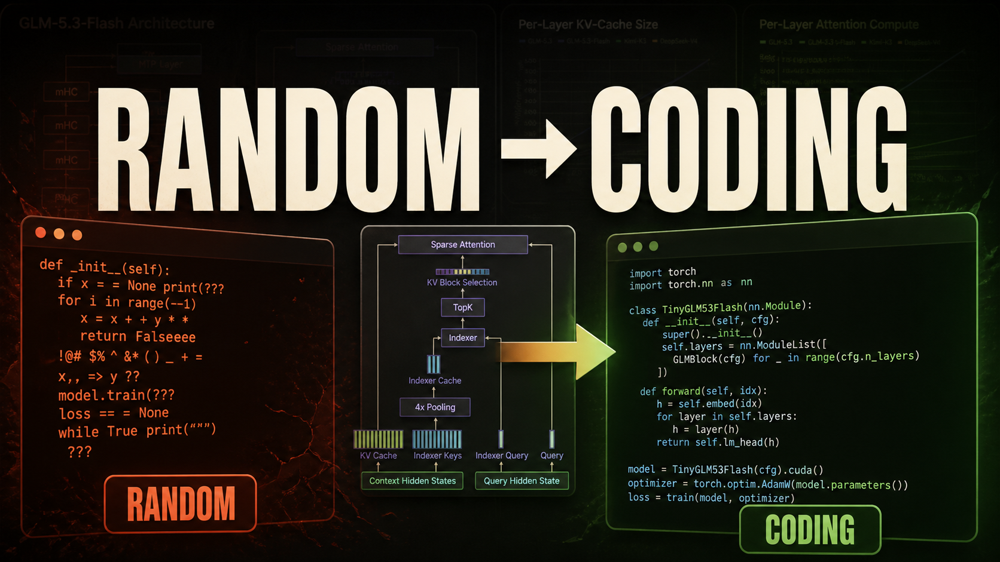
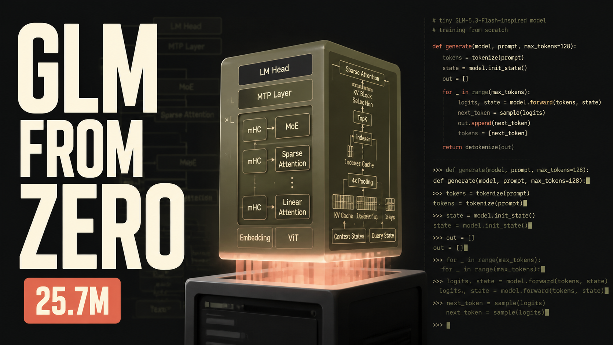

# YouTube packaging

## Title options

1. I Built GLM-5.3-Flash From Scratch – Tiny Version
2. Build and Train GLM-5.3-Flash From Scratch
3. From Random Weights to Python – A Tiny GLM From Scratch
4. I Trained a 25M-Parameter GLM From Zero
5. Can a Tiny GLM Learn to Code?
6. Build a Modern MoE Language Model From Scratch
7. Pretraining, Vision, and RL – One Tiny GLM From Scratch
8. How GLM-5.3-Flash Works – Build the Architecture Yourself
9. I Built a Tiny Multimodal GLM – Then Trained It
10. 25 Million Parameters, From Scratch, on One Machine

Recommended pairing: title 1 with the `RANDOM → CODING` thumbnail. It promises a visible transformation while the words `Tiny Version` keep the claim accurate.

## Thumbnail options

### Random to coding

### GLM from zero

