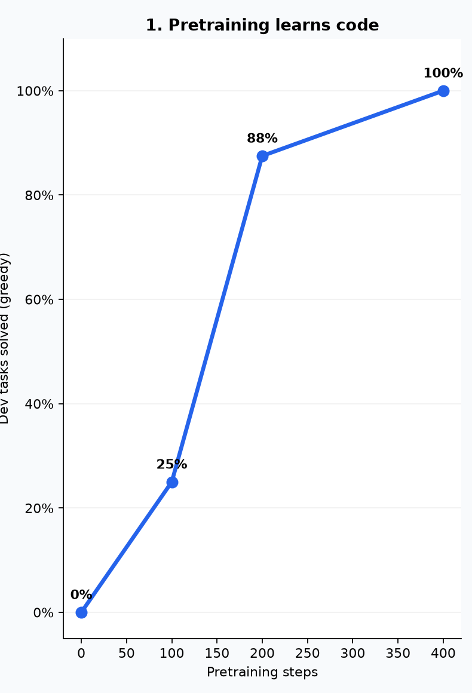

<!-- slide: title -->
# Build & Train GLM-5.3-Flash From Scratch

Random weights → pretraining → executable reward


---

<!-- slide: title -->
# From random weights

25.7 million numbers start with no knowledge

<div class="nn-wrap"><svg id="nn-scene" viewBox="0 0 1400 520" role="img" aria-label="An abstract neural network lighting up layer by layer"><defs><filter id="nn-glow"><feGaussianBlur stdDeviation="6" result="blur"/><feMerge><feMergeNode in="blur"/><feMergeNode in="SourceGraphic"/></feMerge></filter><linearGradient id="nn-line" x1="0" x2="1"><stop stop-color="#53d8fb"/><stop offset="1" stop-color="#8f7cff"/></linearGradient></defs></svg></div>
<style>.nn-wrap{width:min(88vw,1450px);height:53vh;margin-top:1vh}.nn-wrap svg{width:100%;height:100%;overflow:visible}.nn-edge{stroke:url(#nn-line);stroke-width:2;opacity:.13}.nn-node{fill:#111b30;stroke:#6ea8ff;stroke-width:3;filter:url(#nn-glow);animation:nnPulse 2.4s ease-in-out infinite}.nn-spark{fill:#fff;filter:url(#nn-glow);animation:nnSpark 2.8s linear infinite}@keyframes nnPulse{0%,100%{fill:#111b30;opacity:.65}45%{fill:#53d8fb;opacity:1}}@keyframes nnSpark{0%{opacity:0;transform:translateX(0)}15%{opacity:1}85%{opacity:1}100%{opacity:0;transform:translateX(1080px)}}</style>
<script>(()=>{const s=document.getElementById('nn-scene');if(!s||s.dataset.ready)return;s.dataset.ready='1';const NS='http://www.w3.org/2000/svg',xs=[150,500,900,1250],ys=[[95,205,315,425],[70,160,250,340,430],[70,160,250,340,430],[95,205,315,425]];for(let a=0;a<3;a++)for(const y1 of ys[a])for(const y2 of ys[a+1]){const l=document.createElementNS(NS,'line');l.setAttribute('x1',xs[a]);l.setAttribute('y1',y1);l.setAttribute('x2',xs[a+1]);l.setAttribute('y2',y2);l.setAttribute('class','nn-edge');s.appendChild(l)}ys.forEach((layer,li)=>layer.forEach((y,ni)=>{const c=document.createElementNS(NS,'circle');c.setAttribute('cx',xs[li]);c.setAttribute('cy',y);c.setAttribute('r',li===0||li===3?18:15);c.setAttribute('class','nn-node');c.style.animationDelay=`${li*.42+ni*.11}s`;s.appendChild(c)}));[135,245,355].forEach((y,i)=>{const p=document.createElementNS(NS,'circle');p.setAttribute('cx','155');p.setAttribute('cy',y);p.setAttribute('r','7');p.setAttribute('class','nn-spark');p.style.animationDelay=`${i*.8}s`;s.appendChild(p)})})()</script>

---

<!-- slide: title -->
# Code becomes tokens

This model uses one byte per token

<div class="token-flow"><div class="token-row chars"><span>d</span><span>e</span><span>f</span><span>␠</span><span>x</span><span>:</span></div><div class="token-arrow">↓</div><div class="token-row ids"><span>104</span><span>105</span><span>106</span><span>36</span><span>124</span><span>62</span></div></div>
<style>.token-flow{margin-top:4vh}.token-row{display:flex;justify-content:center;gap:18px}.token-row span{display:grid;place-items:center;width:110px;height:110px;border-radius:18px;font-family:ui-monospace,SFMono-Regular,Menlo,monospace;font-size:44px;background:#121c30;border:2px solid #31415f;animation:tokenGlow 3s ease-in-out infinite}.token-row.ids span{height:74px;font-size:28px;color:#53d8fb;border-color:#285879}.token-arrow{font-size:62px;color:#7f8ca8;height:84px}.token-row span:nth-child(2){animation-delay:.18s}.token-row span:nth-child(3){animation-delay:.36s}.token-row span:nth-child(4){animation-delay:.54s}.token-row span:nth-child(5){animation-delay:.72s}.token-row span:nth-child(6){animation-delay:.9s}@keyframes tokenGlow{0%,38%,100%{transform:translateY(0);box-shadow:none}15%{transform:translateY(-8px);border-color:#53d8fb;box-shadow:0 0 30px #53d8fb66}}</style>

---

<!-- slide: full -->
<video src="token-generation-before-after.mp4" autoplay muted loop playsinline style="width:100vw;height:100vh;object-fit:contain;background:#07111f"></video>

---

<!-- slide: title -->
# 0 / 24 → 16 / 24

Held-out greedy coding tasks · before RL → after RL


---

# What we built

| | Released model | Teaching model |
|---|---:|---:|
| Parameters | 320B | **25.7M** |
| Layers | 45 | **12** |
| Active experts | 8 of 288 | **2 of 8** |
| Context | 1M | **192** |

One GPU · text only · trained from random initialization

---

<!-- slide: title -->
# Four steps

## 1. Build the architecture

## 2. Pretrain on code

## 3. Reward programs that pass tests

## 4. Evaluate on unseen tasks

---

<!-- slide: title -->
# The complete data path

<div class="data-path"><span>byte tokens</span><b>→</b><span>embeddings</span><b>→</b><span>4 streams</span><b>→</b><span>12 blocks</span><b>→</b><span>next token</span></div>
<style>.data-path{display:flex;align-items:center;justify-content:center;gap:22px;margin-top:12vh}.data-path span{padding:28px 34px;border-radius:18px;background:#121c30;border:2px solid #334566;font-size:30px;font-weight:700}.data-path span:nth-of-type(4){border-color:#8f7cff;box-shadow:0 0 34px #8f7cff44}.data-path b{font-size:42px;color:#53d8fb}</style>

---

<!-- slide: title -->
# 3 linear + 1 sparse

The four-layer rhythm repeats three times

<div class="layer-stack"><div><span>L</span><span>L</span><span>L</span><span class="sparse">S</span></div><div><span>L</span><span>L</span><span>L</span><span class="sparse">S</span></div><div><span>L</span><span>L</span><span>L</span><span class="sparse">S</span></div></div>
<style>.layer-stack{display:flex;justify-content:center;gap:45px;margin-top:9vh}.layer-stack>div{display:flex;gap:12px;padding:18px;border-radius:22px;background:#10192b}.layer-stack span{display:grid;place-items:center;width:84px;height:120px;border-radius:15px;background:#15304b;border:2px solid #53d8fb;color:#83e7ff;font-size:40px;font-weight:800}.layer-stack .sparse{background:#2b2450;border-color:#9b87ff;color:#c1b6ff;box-shadow:0 0 28px #8f7cff55}</style>

---

<!-- slide: title -->
# Linear attention carries a running memory

Each token updates one compact prefix state

<div class="linear-memory"><div class="lm-tokens"><span>x₁</span><span>x₂</span><span>x₃</span><span>x₄</span><span>x₅</span></div><div class="lm-arrows">↘ &nbsp;&nbsp; ↓ &nbsp;&nbsp; ↓ &nbsp;&nbsp; ↓ &nbsp;&nbsp; ↙</div><div class="lm-state">running key–value state</div></div>
<style>.linear-memory{margin-top:7vh}.lm-tokens{display:flex;justify-content:center;gap:42px}.lm-tokens span{display:grid;place-items:center;width:96px;height:96px;border-radius:50%;background:#121c30;border:3px solid #53d8fb;font-size:32px}.lm-arrows{margin:24px 0;color:#6ea8ff;font-size:58px;letter-spacing:28px}.lm-state{display:inline-block;padding:30px 80px;border-radius:20px;background:linear-gradient(90deg,#12304a,#28204d);border:2px solid #7d8cff;font-size:34px;font-weight:700;box-shadow:0 0 45px #53d8fb33}</style>

---

<!-- slide: title -->
# Sparse attention retrieves selected positions

Local window + regularly spaced anchors

<div class="sparse-row"><span class="anchor">0</span><span>1</span><span>2</span><span>3</span><span class="anchor">4</span><span>5</span><span>6</span><span>7</span><span class="anchor">8</span><span>9</span><span class="local">10</span><span class="local">11</span><span class="local">12</span><span class="local">13</span><span class="current">14</span></div>
<div class="sparse-key"><b>anchors</b> reach far back <i>+</i> <strong>local tokens</strong> preserve detail</div>
<style>.sparse-row{display:flex;justify-content:center;gap:10px;margin-top:12vh}.sparse-row span{display:grid;place-items:center;width:72px;height:82px;border-radius:12px;background:#121c30;border:2px solid #293a58;color:#7f8ca8;font-size:25px}.sparse-row .anchor{border-color:#8f7cff;color:#c4b9ff;background:#2b2450}.sparse-row .local{border-color:#53d8fb;color:#9eeeff;background:#15304b}.sparse-row .current{border-color:#36d399;background:#123c38;color:#7df5c7;box-shadow:0 0 30px #36d39966}.sparse-key{margin-top:60px;font-size:27px;color:#aeb8ca}.sparse-key b{color:#c4b9ff}.sparse-key strong{color:#9eeeff}.sparse-key i{padding:0 24px;color:#fff}</style>

---

<!-- slide: title -->
# Each token chooses experts

Two routed experts + one shared expert

<div class="moe-flow"><div class="moe-token">token</div><div class="moe-arrow">→</div><div class="moe-router">router</div><div class="moe-arrow">→</div><div class="experts"><span>E1</span><span class="on">E2</span><span>E3</span><span>E4</span><span>E5</span><span>E6</span><span class="on">E7</span><span>E8</span><strong>shared</strong></div></div>
<style>.moe-flow{display:flex;align-items:center;justify-content:center;gap:28px;margin-top:8vh}.moe-token,.moe-router{display:grid;place-items:center;width:150px;height:110px;border-radius:18px;background:#121c30;border:2px solid #53d8fb;font-size:30px;font-weight:700}.moe-router{border-color:#8f7cff}.moe-arrow{font-size:48px;color:#6ea8ff}.experts{display:grid;grid-template-columns:repeat(4,82px);gap:12px}.experts span,.experts strong{display:grid;place-items:center;height:72px;border-radius:12px;background:#121c30;border:2px solid #31415f;color:#7f8ca8;font-size:22px}.experts .on{background:#153f3a;border-color:#36d399;color:#72f2c1;box-shadow:0 0 25px #36d39944}.experts strong{grid-column:1/5;background:#2b2450;border-color:#9b87ff;color:#d0c7ff}</style>

---

<!-- slide: title -->
# Four residual streams

Mix before the block · route the update back afterward

<div class="streams"><div class="stream-lines"><i></i><i></i><i></i><i></i></div><b>mix</b><em>→</em><strong>attention + MoE</strong><em>→</em><b>route</b><div class="stream-lines out"><i></i><i></i><i></i><i></i></div></div>
<style>.streams{display:flex;align-items:center;justify-content:center;gap:26px;margin-top:12vh}.stream-lines{display:grid;gap:18px;width:210px}.stream-lines i{height:10px;border-radius:8px;background:linear-gradient(90deg,#53d8fb,#8f7cff);box-shadow:0 0 16px #53d8fb44}.stream-lines.out i:nth-child(2){transform:translateX(16px)}.stream-lines.out i:nth-child(3){transform:translateX(-12px)}.streams b{display:grid;place-items:center;width:110px;height:110px;border-radius:50%;background:#2b2450;border:2px solid #9b87ff;font-size:28px}.streams strong{padding:34px 46px;border-radius:18px;background:#121c30;border:2px solid #53d8fb;font-size:30px}.streams em{font-style:normal;font-size:42px;color:#6ea8ff}</style>

---

# The model configuration

```python
ModelConfig(
    vocab_size=260,
    dim=192,
    layers=12,
    heads=6,
    experts=8,
    top_k=2,
    streams=4,
    max_sequence_length=192,
)
```

---

# One hybrid block

```python
def forward(self, x):
    x = x + self.attention(self.attention_norm(x))

    ffn, usage = self.moe(self.ffn_norm(x))

    return x + ffn, usage
```

Attention reads tokens. MoE transforms them.

---

# Assemble all twelve layers

```python
self.layers = nn.ModuleList([
    HyperConnection(
        config,
        HybridBlock(config, sparse=((i + 1) % 4 == 0)),
    )
    for i in range(config.layers)
])
```

Every fourth block receives sparse attention.

---

# The forward pass

```python
embedded = self.embedding(input_ids)
streams = embedded.unsqueeze(2).expand(-1, -1, 4, -1)

for layer in self.layers:
    streams, usage = layer(streams)

hidden = self.final_norm(streams.mean(dim=2))
logits = self.output(hidden)
```

---

<!-- slide: title -->
# Prove the model is wired correctly

<div class="checks"><span>✓ tokenizer round-trip</span><span>✓ causal outputs</span><span>✓ 3:1 attention rhythm</span><span>✓ expert usage sums to 1</span><span>✓ active &lt; total parameters</span></div>
<style>.checks{display:grid;grid-template-columns:repeat(2,minmax(380px,1fr));gap:24px;max-width:1050px;margin:9vh auto 0}.checks span{padding:25px 30px;border-radius:16px;background:#12253a;border-left:6px solid #36d399;text-align:left;font-size:27px}.checks span:last-child{grid-column:1/3}</style>

---

# One pretraining example

```python
# Complete this Python function.
# Return x plus one.
def increment_qrdadnk(x):
    return x + 1
```

The model sees complete Python programs.

---

<!-- slide: title -->
# Learn by predicting the next token

<div class="next-token"><div><small>INPUT</small><code>return&nbsp; x&nbsp; +</code></div><b>→</b><div class="target"><small>TARGET</small><code>1</code></div></div>
<style>.next-token{display:flex;justify-content:center;align-items:center;gap:55px;margin-top:12vh}.next-token>div{display:grid;gap:22px;padding:38px 52px;border-radius:20px;background:#121c30;border:2px solid #334566}.next-token small{color:#7f8ca8;font-size:21px;font-weight:800;letter-spacing:.14em}.next-token code{font-size:50px;color:#e7edf8}.next-token b{font-size:58px;color:#53d8fb}.next-token .target{border-color:#36d399;box-shadow:0 0 36px #36d39944}.next-token .target code{color:#72f2c1}</style>

---

# The pretraining step

```python
logits, usage = model(inputs)

loss = cross_entropy(logits, labels)
loss += 0.01 * router_balance_loss(usage)

loss.backward()
clip_grad_norm_(model.parameters(), 1.0)
optimizer.step()
```

Predict → compare → backpropagate → update

---

<!-- slide: title -->
# Pretraining learns the coding patterns



1.38M tokens · 400 steps · 63 seconds

---

<!-- slide: title -->
# Pretraining makes code-shaped text

But the programs still fail hidden tests

<div class="bad-code"><code>return x * * 0 0</code><strong>INVALID PYTHON</strong></div>
<style>.bad-code{display:grid;gap:35px;margin-top:10vh}.bad-code code{padding:40px 70px;border-radius:20px;background:#121c30;border:2px solid #ef5b67;font-size:52px;color:#f4f7ff}.bad-code strong{font-size:32px;color:#ef5b67;letter-spacing:.08em}</style>

---

<!-- slide: title -->
# Turn execution into reward

<div class="reward-pipe"><span>generate code</span><b>→</b><span>run tests</span><b>→</b><span>score it</span><b>→</b><span>update model</span></div>
<style>.reward-pipe{display:flex;align-items:center;justify-content:center;gap:24px;margin-top:13vh}.reward-pipe span{padding:30px 34px;border-radius:18px;background:#121c30;border:2px solid #334566;font-size:29px;font-weight:700}.reward-pipe span:nth-of-type(2){border-color:#53d8fb}.reward-pipe span:nth-of-type(3){border-color:#36d399}.reward-pipe span:nth-of-type(4){border-color:#8f7cff}.reward-pipe b{font-size:43px;color:#6ea8ff}</style>

---

<!-- slide: title -->
# The reward is executable

<div class="reward-values"><div class="pass"><b>+1</b><span>all tests pass</span></div><div><b>0</b><span>valid but wrong</span></div><div class="invalid"><b>−0.1</b><span>invalid Python</span></div></div>
<style>.reward-values{display:flex;justify-content:center;gap:30px;margin-top:11vh}.reward-values>div{display:grid;gap:18px;width:310px;padding:38px 24px;border-radius:20px;background:#121c30;border:2px solid #334566}.reward-values b{font-size:66px}.reward-values span{font-size:25px;color:#aeb8ca}.reward-values .pass{border-color:#36d399}.reward-values .pass b{color:#72f2c1}.reward-values .invalid{border-color:#ef5b67}.reward-values .invalid b{color:#ff7a85}</style>

---

# The verifier runs hidden tests

```python
tree = validate_source(source, task.entry_point)
exec(compile(tree, "candidate.py", "exec"), namespace)
function = namespace[task.entry_point]

for arguments, expected in task.cases:
    actual = function(*arguments)
    passed += int(type(actual) is type(expected)
                  and actual == expected)
```

Unsafe syntax and imports are rejected before execution.

---

<!-- slide: title -->
# Generate 16 attempts for one prompt

<div class="rollouts"><span class="good">+1</span><span>0</span><span class="bad">−.1</span><span>0</span><span class="good">+1</span><span>0</span><span>0</span><span class="good">+1</span><span>0</span><span class="bad">−.1</span><span class="good">+1</span><span>0</span><span>0</span><span class="good">+1</span><span>0</span><span class="bad">−.1</span></div>
<style>.rollouts{display:grid;grid-template-columns:repeat(8,82px);gap:18px;justify-content:center;margin-top:10vh}.rollouts span{display:grid;place-items:center;width:82px;height:82px;border-radius:50%;background:#1a2336;border:2px solid #43506a;color:#aeb8ca;font-size:24px;font-weight:800}.rollouts .good{border-color:#36d399;background:#123c38;color:#72f2c1;box-shadow:0 0 22px #36d39944}.rollouts .bad{border-color:#ef5b67;background:#3a1c2a;color:#ff8791}</style>

---

<!-- slide: title -->
# Compare each attempt with the others

<div class="advantage"><code>advantageᵢ = rewardᵢ − mean(other rewards)</code><div><span class="up">better → more likely</span><span class="down">worse → less likely</span></div></div>
<style>.advantage{display:grid;gap:60px;margin-top:11vh}.advantage code{padding:38px 55px;border-radius:20px;background:#121c30;border:2px solid #8f7cff;font-size:40px}.advantage>div{display:flex;justify-content:center;gap:35px}.advantage span{padding:22px 32px;border-radius:14px;font-size:27px;font-weight:700}.advantage .up{background:#123c38;color:#72f2c1}.advantage .down{background:#3a1c2a;color:#ff8791}</style>

---

<!-- slide: title -->
# Update only 2.19M parameters

Last block + final normalization + tied output head

<div class="train-scope"><div class="frozen"><span></span><span></span><span></span><span></span><span></span><span></span><span></span><span></span><span></span><span></span><span></span></div><div class="trainable">block 12</div><b>→</b><div class="head">output head</div></div>
<style>.train-scope{display:flex;align-items:center;justify-content:center;gap:18px;margin-top:10vh}.frozen{display:flex;gap:7px}.frozen span{width:28px;height:95px;border-radius:7px;background:#273044;border:2px solid #44506a}.trainable,.head{display:grid;place-items:center;height:112px;padding:0 28px;border-radius:14px;background:#123c38;border:2px solid #36d399;color:#72f2c1;font-size:25px;font-weight:800;box-shadow:0 0 28px #36d39944}.train-scope b{font-size:42px;color:#53d8fb}</style>

---

# The RLOO update

```python
generations = generate_group(model, task, group_size=16)
rewards = [reward_for(task, g) for g in generations]
advantages = leave_one_out(rewards)

log_probs = completion_log_probabilities(model, generations)
loss = -(advantages * log_probs).mean()

loss.backward()
optimizer.step()
```

No reference completion is shown during RL.

---

<!-- slide: title -->
# The policy improves during RL


1,536 rollouts · 96 prompt groups · 155 seconds

---

<!-- slide: title -->
# Open the confirmation set once

<div class="split-lock"><div><span>TRAIN</span><b>learn</b></div><i>→</i><div><span>DEV</span><b>choose checkpoint</b></div><i>→</i><div class="locked"><span>CONFIRM</span><b>🔒 unseen tasks</b></div></div>
<style>.split-lock{display:flex;align-items:center;justify-content:center;gap:28px;margin-top:12vh}.split-lock>div{display:grid;gap:15px;width:260px;padding:32px;border-radius:18px;background:#121c30;border:2px solid #334566}.split-lock span{font-size:30px;font-weight:800;color:#53d8fb}.split-lock b{font-size:22px;color:#aeb8ca}.split-lock i{font-style:normal;font-size:45px;color:#6ea8ff}.split-lock .locked{border-color:#36d399}.split-lock .locked span{color:#72f2c1}</style>

---

<!-- slide: title -->
# Improvement survives untouched tasks


Greedy trained families: **0 / 24 → 16 / 24**

---

<!-- slide: title -->
# The gains are not uniform


---

<!-- slide: title -->
# What changed

<div class="family-summary"><span class="gain">increment ↑</span><span class="gain">double ↑</span><span class="flat">even —</span><span class="loss">square ↓</span><span class="loss">list sum ↓</span></div>
<style>.family-summary{display:flex;justify-content:center;gap:22px;flex-wrap:wrap;max-width:1100px;margin:13vh auto 0}.family-summary span{padding:26px 34px;border-radius:16px;background:#121c30;border:2px solid #334566;font-size:30px;font-weight:800}.family-summary .gain{border-color:#36d399;color:#72f2c1}.family-summary .flat{border-color:#8f7cff;color:#c4b9ff}.family-summary .loss{border-color:#ef5b67;color:#ff8791}</style>

---

<!-- slide: title -->
# The result

Executable feedback made narrow coding behaviors more reliable

<div class="result-final"><strong>0 / 24</strong><b>→</b><strong>16 / 24</strong></div>
<style>.result-final{display:flex;justify-content:center;align-items:center;gap:55px;margin-top:10vh}.result-final strong{font-size:92px}.result-final strong:last-child{color:#72f2c1;text-shadow:0 0 35px #36d39955}.result-final b{font-size:70px;color:#53d8fb}</style>
